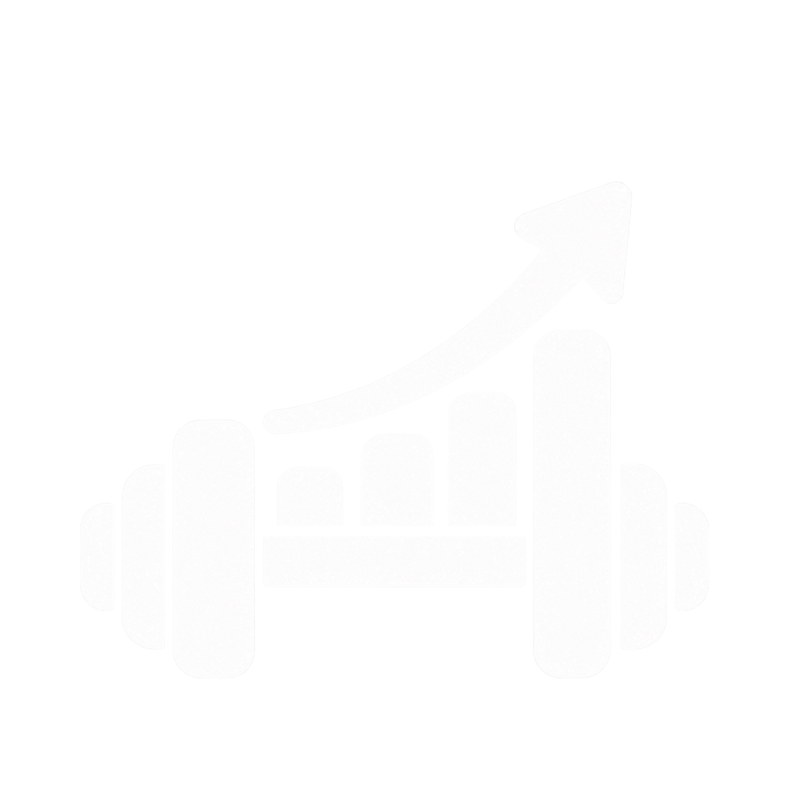

# Repwise

Local-first workout tracking built for consistency.

Repwise is a mobile-first Progressive Web App for creating workout routines, logging sessions, tracking personal records, monitoring progress, and backing up data locally or to Google Drive.

It runs primarily in the browser using IndexedDB, so it can be used offline after the app has been loaded and its assets cached. There is no required backend for normal day-to-day use.

<p align="center">
  
</p>

---

## Overview

Repwise is designed around a simple principle: your workout data belongs to you, and the app should work with minimal friction in offline or low-connectivity situations.

The project currently includes:

- A custom exercise library with built-in and user-created exercises
- A routine builder for reusable training plans
- An active workout session with set logging and rest timer
- Exercise history and previous performance suggestions while logging
- Dashboard summaries, streaks, and personal-record tracking
- Progress analytics for volume, estimated 1RM, and body-weight trends
- JSON export/import for manual backup and restore
- Optional Google Drive AppData backup and restore integration
- Installable PWA behavior for mobile/browser usage

---

## Tech stack

- Next.js 14
- React 18
- TypeScript
- Tailwind CSS
- Dexie.js + IndexedDB
- Recharts
- Lucide React
- Google Identity / Google Drive API
- PWA support via @ducanh2912/next-pwa

---

## Architecture

Repwise is intentionally local-first.

```text
Repwise PWA
   │
   ├─ Next.js + React UI
   │
   ├─ Dexie.js / IndexedDB
   │     ├─ exercises
   │     ├─ routines
   │     ├─ routineItems
   │     ├─ workouts
   │     ├─ workoutExercises
   │     ├─ sets
   │     ├─ bodyWeights
   │     └─ settings
   │
   └─ Optional Google Drive sync
         └─ drive.appdata backup file
```

Key design decisions:

- Primary storage is IndexedDB on the user's device.
- Core functionality works without a backend.
- Google Drive is optional and used only when the user opts in.
- Exports are portable JSON backups that can be restored manually.
- Authentication and backup are browser-side, with the app using Google Drive AppData storage for the backup artifact.

---

## Implemented features

### Workout planning

- Create and manage workout routines
- Add exercises to routines with set/rep/weight/rest targets
- Start routine-based or freestyle workouts
- Reuse previous performance as starting values for the next session

### Workout logging

- Record a workout session and its exercises
- Log sets with weight, reps, set type, completion state, and notes
- Use a rest timer while working through the workout
- Save incomplete sessions and continue later if needed

### Progress and analytics

- Workout streak tracking
- Estimated 1RM calculation
- Volume tracking
- Body-weight logging
- Exercise PR summaries on the dashboard and progress screens

### Backup and sync

- JSON export/import
- Google Drive AppData backup upload
- Google Drive restore from backup
- Local logout and local data cleanup

### PWA and offline

- Offline-capable app shell
- Installable on supported browsers/devices
- Cached assets after first load
- Local-first data access after assets are cached

---

## Project structure

```text
repwise/
├── public/
│   ├── manifest.json
│   ├── sw.js
│   ├── logo.png
│   └── ...
├── src/
│   ├── app/
│   │   ├── dashboard/
│   │   ├── privacy/
│   │   ├── progress/
│   │   ├── settings/
│   │   ├── terms/
│   │   ├── workouts/
│   │   ├── layout.tsx
│   │   ├── loading.tsx
│   │   └── page.tsx
│   ├── components/
│   ├── db/
│   ├── hooks/
│   ├── lib/
│   └── types/
├── .env.local.example (if used locally)
├── eslint.config.mjs
├── next.config.mjs
├── package.json
├── postcss.config.mjs
├── tailwind.config.ts
├── tsconfig.json
├── LICENSE
├── README.md
└── AGENTS.md
```

---

## Getting started

### Prerequisites

- Node.js 18.17 or later
- npm
- Git

### Install

```bash
git clone https://github.com/abdulrahmanm-in/repwise.git
cd repwise
npm install
```

### Run locally

```bash
npm run dev
```

Then open:

- http://localhost:3000

### Production build

```bash
npm run build
npm run start
```

---

## Optional Google Drive setup

Google Drive backup is optional. The app works without it.

To enable backup, create an OAuth client in Google Cloud and add the client ID to your local environment:

```env
NEXT_PUBLIC_GOOGLE_CLIENT_ID=your-google-client-id
```

Then restart the development server.

Important:

- The app requests the Google Drive AppData scope for a private app-data backup file.
- The client ID is public-facing by design and is not a secret.
- Do not place client secrets or private credentials in `NEXT_PUBLIC_` variables.
- Make sure the Google OAuth allowed origins and redirect URIs match your app deployment.

---

## Data and privacy

Repwise is built around data ownership and privacy by default.

- No account is required for standard offline usage.
- Workout logs, routines, and settings are stored in browser IndexedDB.
- Data is tied to the browser profile/device unless backed up elsewhere.
- Google Drive is optional and only used when explicitly connected.
- JSON exports provide a portable backup path.

Because local browser storage is not a full backup system, users should regularly export JSON backups or use Google Drive sync if they want an external copy.

---

## Current status

This project is a working local-first fitness tracker and PWA. The main implemented flows are:

- exercise management
- routine creation
- workout session logging
- progress dashboard and analytics
- local persistence and manual/optional cloud backup
- installable mobile-friendly UI

The app is ready for local usage and iterative feature expansion, especially in the areas of test coverage, stronger data/migration management, and advanced coaching recommendations.

---

## Suggested improvements

The project is already functional and polished for a personal tracking app. The next improvements that would add the most value are:

1. Automated testing
   - Add unit tests for formulas and backup/import logic.
   - Add integration tests for routine creation, workout completion, and restore flows.

2. Stronger data migration/versioning
   - Introduce structured schema versioning and migration scripts for Dexie upgrades.
   - Prevent future breaking changes when adding new fields or tables.

3. Better auth and sync state management
   - Centralize Google Drive and local auth state to reduce duplication across screens.
   - Add clearer user-facing sync status and retry handling.

4. Safer backup/restore UX
   - Add explicit conflict resolution and restore previews before replacing local data.
   - Warn clearly when a backup would override a current local dataset.

5. More workout intelligence
   - Add progressive overload suggestions based on recent performance.
   - Explore trend-based recommendations and volume load analysis.

6. Improved accessibility and testing on real devices
   - Verify keyboard/focus flows and large-text accessibility.
   - Test on iOS/Android browsers for PWA install and offline behavior.

7. More refined app state consistency
   - Reduce the number of ad hoc localStorage checks and duplicate onboarding logic.
   - Consider a single settings store for defaults and UI preferences.

---

## Roadmap

- [x] Exercise library
- [x] Routine builder
- [x] Workout logging
- [x] Workout history
- [x] Personal records
- [x] Progress tracking
- [x] Body-weight tracking
- [x] Streak tracking
- [x] Rest timer
- [x] Offline support
- [x] PWA support
- [x] JSON backup/import
- [x] Google Drive backup
- [ ] Progressive overload recommendations
- [ ] Advanced health/integration features

---

## License

This project is licensed under the MIT License. See [LICENSE](LICENSE) for details.

---

<p align="center">
  <strong>Repwise — Train. Track. Progress.</strong>
</p>
